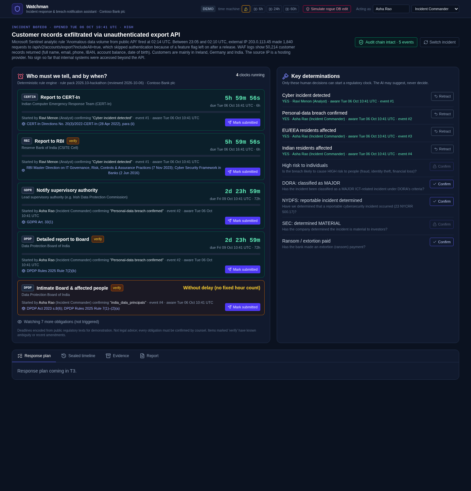
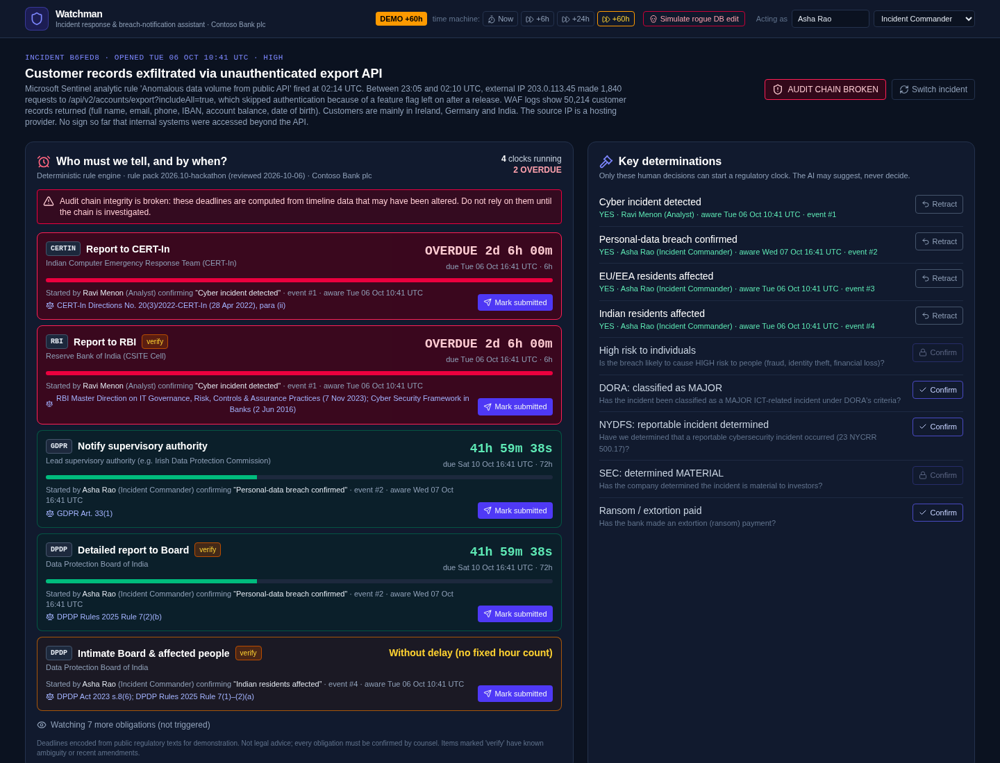
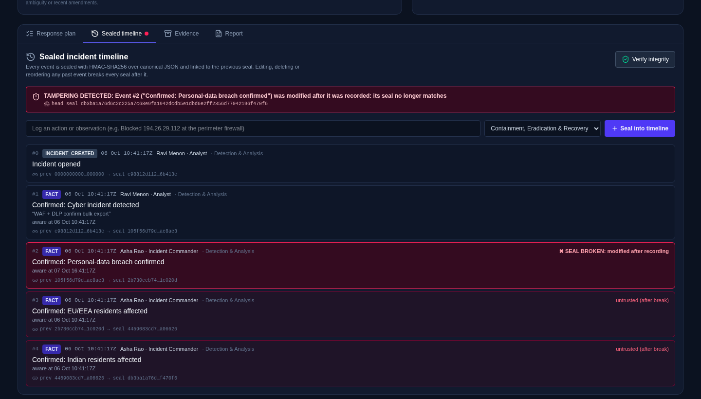
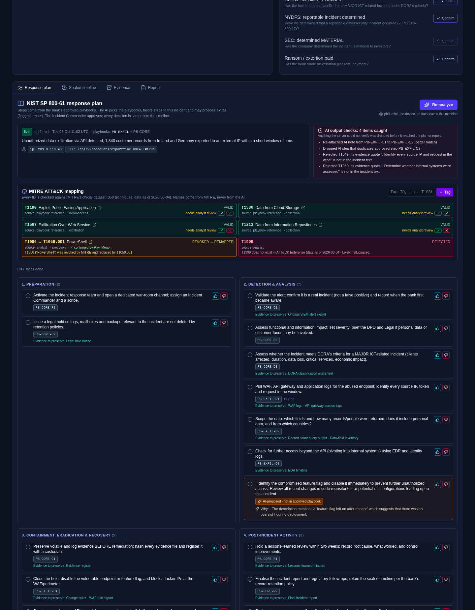
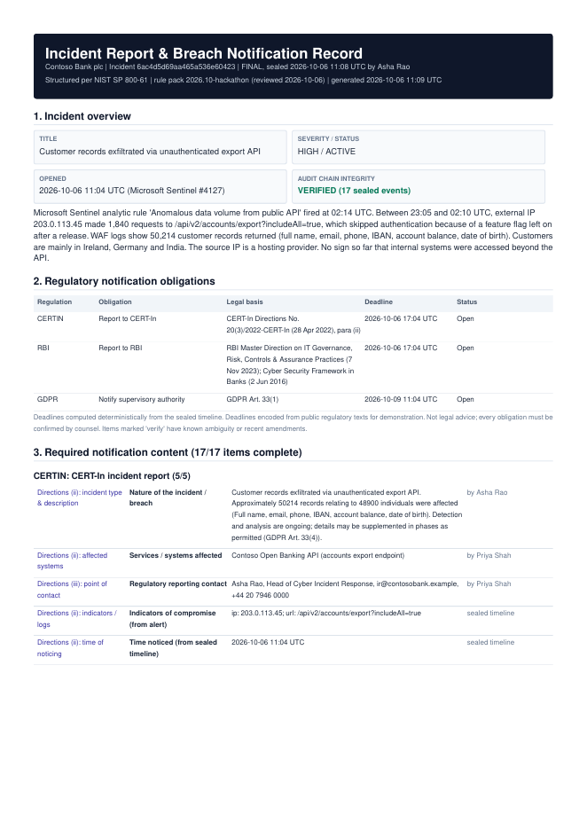
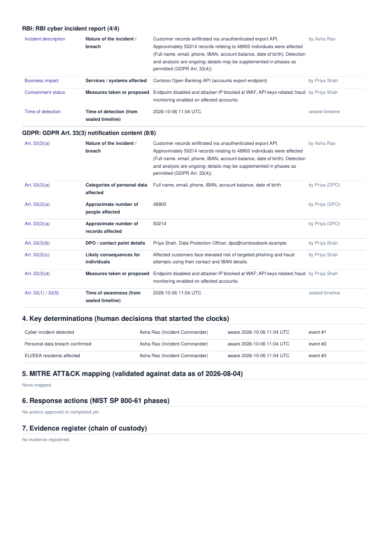
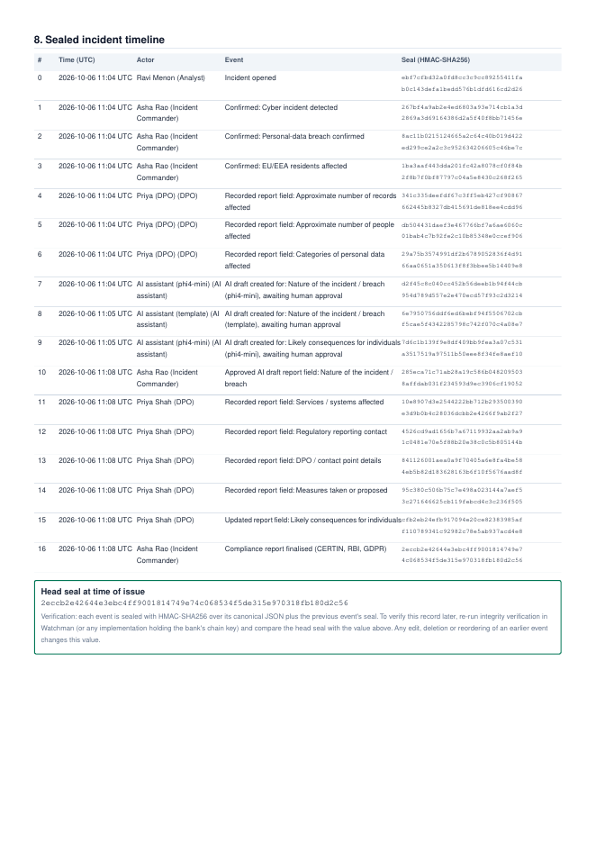

# Watchman — Build Progress Log

> Build log: what was done at each step, and why. **New here? Start with the [README](../README.md)**; it explains how to run and use everything. Jargon is explained in the [Glossary in PLAN.md](PLAN.md#glossary).
> Each entry covers: **What we did · Why (plain English) · Files touched · How we checked it · If a judge asks**.

## Status board

| Step | What | Status |
|---|---|---|
| D0 | Plan + progress docs | ✅ Done |
| T0 | Unbreak the app (env, database, junk text, styling, refresh) | ✅ Done |
| T1 | Tamper-evident timeline + tamper demo | ✅ Done |
| T2 | Regulatory clock engine (7 regulations) | ✅ Done |
| T3 | Grounded playbooks + on-device AI (Phi) with fallbacks | ✅ Done |
| T4 | Compliance report + completeness checker | ✅ Done |
| T5 | MITRE ATT&CK ID validation | ✅ Done (pulled forward, T3 needed it) |
| T6 | Evidence registry (chain of custody) | ✅ Done |
| T7 | Sample incidents + offline AI replay | ✅ Done |
| — | Stretch: DPO waiver · Teams card · Sentinel paste · Navigator export | ✅ Done |
| — | Full demo rehearsal in the browser + run/demo docs | ✅ Done |

**Start here:** [RUNNING.md](RUNNING.md) (how to start) · [DEMO.md](DEMO.md) (3-minute script) · [PLAN.md](PLAN.md) (what & why + glossary)

**Things the human needs to do:**
- [x] ~~Start the local database with sudo~~: no longer needed. We run MongoDB as a normal user with `npm run db` (see T0).
- [x] `phi4-mini` downloaded (2.5 GB) and set as the default model.

---

## D0 — Plan + progress docs ✅

**What we did.** Wrote [`PLAN.md`](PLAN.md) (what we're building and why, the demo script, and a glossary) and this log.

**Why.** A hackathon is judged on the story as much as the code. If anyone on the team can read these two files and explain every feature, the pitch is stronger and Q&A is safer.

**Files touched.** `docs/PLAN.md` and `docs/PROGRESS.md` (new).

**How we checked it.** Nothing to run; these are documents.

**If a judge asks "how did you approach this?":** "We started by asking where an AI is *dangerous* in a bank's incident response: deadlines, legal triggers, attack codes, report fields. Then we made those parts rule-based and verifiable, and used AI only for suggestions a human confirms."

---

## T0 — Unbreak the app ✅

**What we did, and why each thing mattered:**

1. **Settings file found reliably.** The server keeps its settings (database address, AI keys) in a file called `.env`. That file lived one folder above where the server looked, so the server started with *no settings*, couldn't find the database, and shut down. We added `src/config/env.js`, which always loads `watchman_1/.env` no matter where you start the server from. *Analogy: the server was looking for its keys in the wrong drawer.*
2. **Local database instead of the cloud one.** The project pointed at MongoDB Atlas (a cloud database). On venue wifi that's a single point of failure: if the internet hiccups during the demo, everything dies. We now run MongoDB **on the laptop**, storing its data in `watchman/.mongo-data/`. The cloud address is still in `.env`, commented out, as a backup. A new command, `npm run db`, starts the local database (no admin password needed).
3. **Removed the `[cite: 1, 2]` junk** from 15 places in the UI and PDF. This was text accidentally pasted from an AI chat.
4. **Fixed the styling.** The panels used colour names (`panelDark`, `borderDark`) that were never defined, so they rendered with no background or border. We defined them in `client/src/index.css`.
5. **One place for the server address.** The browser app had `http://localhost:5000` hard-coded in two files. Now there's `client/src/api.js`, and the dev server forwards (proxies) `/api` to the backend.
6. **Refresh no longer loses your incident.** The open incident's ID now lives in the URL (`…/#<id>`), and the server got a "list incidents" endpoint.
7. **Bad IDs return a clear error.** Requesting `/api/incidents/garbage` used to crash with a 500 error; now it returns a clear "400 Invalid incident ID".
8. **New settings added to `.env`:** which AI to use (`LLM_PROVIDER=ollama`), the local AI model, a `DEMO_MODE` switch, and a random `CHAIN_SECRET` (used in T1). The original `.env` was backed up as `.env.bak-before-t0`. Both files are ignored by git.

**Files touched.**
- Server: `server/src/config/env.js` (new), `server.js`, `routes/index.js`, `routes/incident.routes.js`, `controllers/incident.controller.js`, `services/aiService.js`, `package.json` (new `db` and `test` scripts).
- Client: `client/src/api.js` (new), `App.jsx`, `components/AuditTimeline.jsx`, `index.css`, `vite.config.js`, `index.html` (title).
- Repo: `.gitignore`.

**How we checked it.**
```
curl localhost:5000/health                → {"status":"OK"}
curl localhost:5000/api/incidents         → []
curl localhost:5000/api/incidents/notanid → {"error":"Invalid incident ID format"}
POST /api/incidents through the Vite proxy (port 5173) → created, 1 timeline event
npx vite build                            → built OK
grep "cite:" client/src                   → 0 matches
```

**Security note.** Rotate the Gemini API key after the hackathon as general hygiene; it is only needed if `LLM_PROVIDER=gemini`.

**If a judge asks "why does it run locally?":** "A bank's incident data includes customer PII. Running the database and the AI on the responder's machine means no breach data leaves the bank during the incident, and the tool still works if the network is down, which is common during a real cyber attack."

---

## T1 — Tamper-evident timeline (server) ✅

**The idea in one picture:**
```
event #0 ──seal──► event #1 ──seal──► event #2 ──seal──► event #3
 (hash includes     (hash includes     (hash includes
  "0000…")           #0's hash)         #1's hash)
```
Each event's **seal** (hash) is computed from its own contents *plus the previous event's seal*. Change anything in event #1 and its seal changes, so event #2's link no longer matches, and so on. *Analogy: a stack of documents where every page is stamped with a fingerprint of the page before it. Swap or edit one page and every later stamp is visibly wrong.*

**What we changed:**
1. **The seal covers every field.** Previously the "phase" field wasn't included, so someone could quietly change *which phase* an action belonged to. Now the seal covers: sequence number, time, event type, action, NIST phase, who did it, their role, all details, and the previous seal.
2. **Canonical JSON.** Before hashing, data is written in a fixed order (keys sorted), so the same content always produces the same fingerprint.
3. **Keyed seal (HMAC).** A plain SHA-256 hash can be recomputed by anyone. A rogue database admin could edit an entry and then recalculate every later hash so the chain looks fine again. HMAC mixes in a secret key (`CHAIN_SECRET` in `.env`) that only the server knows, so editing the database alone is no longer enough to forge a valid chain. *Analogy: a wax seal pressed with a signet ring only the server owns.*
4. **One way in.** All four controllers used to copy-paste their own hashing code (one copy was even buggy). Now there's exactly one function, `appendEvent()`, and nothing else adds to the timeline.
5. **Better verification.** `verifyChain()` now reports the *first broken event*, why it broke, and marks everything after it as "untrusted". That lets the UI paint the timeline red from the break onward.
6. **No forks.** If two people log an action at the same instant, both could link to the same previous event and fork the chain. The database now uses "optimistic concurrency": the second save notices and retries.
7. **The tamper demo button** (`POST /api/demo/tamper/:id`, only when `DEMO_MODE=1`). It plays a rogue insider who edits the database *directly*, bypassing our app, and moves the "we became aware of the breach" time 30 hours later to hide a missed deadline. That's the most realistic and most damaging edit possible here.

**Files touched.**
- `server/src/utils/cryptoChain.js` (rewritten) and `server/src/models/Incident.js` (redesigned for all features).
- New: `services/incidentStore.js`, `utils/httpError.js`, `controllers/demo.controller.js`, `routes/demo.routes.js`.
- Rewritten: `controllers/incident.controller.js`, `controllers/timeline.controller.js`.
- The old `playbook` and `regulatoryClock` routes are unplugged until T3 replaces them. The files are kept (no deletions).

**How we checked it.** 5 automated tests (`npm test`): a fresh chain verifies; editing action/phase/details/time/actor is caught at the exact event; deleting an event is caught; an attacker without the secret key can't re-seal. Live API test:
```
BEFORE tamper: valid=True, 2 events
AFTER  tamper: valid=False, firstBrokenIndex=1, statuses ['ok','tampered']
```

**If a judge asks "couldn't an admin just recompute the hashes?":** "Not without the server's signing key. The seal is an HMAC, not a plain hash. And the head hash is printed in every PDF report, so even someone holding the key can't rewrite history without the mismatch showing against reports already sent. In production we'd anchor that head hash in Azure Confidential Ledger."

---

## T2 — Regulatory clock engine (server) ✅

**The problem it solves.** The original app had one "72-hour" clock that started the moment an incident was created, or whenever the AI guessed "breach". Both are legally wrong:
- GDPR's 72 hours start when the bank becomes **aware** of a **personal-data** breach, not when the first alert fires.
- Different laws start their clocks on **different events** and count **differently** (hours vs. business days).
- An AI must never be the thing that starts a legal clock.

**How it works now:**
```
Human confirms a FACT ─► sealed into timeline ─► rule engine reads timeline ─► obligations + deadlines
(e.g. "Personal-data breach            (who, when,        (pure rules,          ("GDPR Art. 33: notify
 confirmed", by Asha, IC, 14:02)        role recorded)     no AI)                 regulator by Thu 14:02")
```
1. **Facts** (`rules/facts.json`). There are 9 yes/no determinations, e.g. "Cyber incident detected", "Personal-data breach confirmed", "EU residents affected", "DORA: classified as MAJOR", "SEC: determined MATERIAL". Each says **who is allowed to confirm it**:
   - An Analyst can't declare a personal-data breach; that's the Incident Commander's or DPO's call.
   - Only Legal can declare an incident "material" for the SEC.
   - The AI may *suggest* facts (T3) but can never confirm them, and it's not even allowed to suggest "material" or "ransom paid".
2. **Rule pack** (`rules/regulations.json`). 7 regulations, 12 obligations, each with its legal citation, the exact legal wording, a plain-English summary, and what starts its clock. It's just data: lawyers can review it without reading code. Items with known uncertainty (RBI, DPDP, SEC holidays) are flagged **"verify"**, and the file carries a version and "reviewed on" date.

   | Regulation | Obligation | Deadline | Clock starts when… |
   |---|---|---|---|
   | GDPR Art. 33 | Notify the data-protection regulator | 72h | personal-data breach confirmed + EU residents affected |
   | GDPR Art. 34 | Notify affected people | "without undue delay" | …plus DPO judges *high risk* |
   | DORA | Initial / intermediate / final report | 4h after "major" (max 24h after detection) / 72h after initial / 1 month after intermediate | classification as major |
   | CERT-In | Report to India's CERT | 6h | cyber incident detected |
   | RBI | Report to Reserve Bank of India | 6h ⚠ verify | cyber incident detected |
   | DPDP | Tell Board + people; detailed report | without delay; 72h ⚠ verify | breach confirmed + Indian residents affected |
   | NYDFS 500.17 | Notify NY regulator; ransom payment notice | 72h; 24h | reportable incident determined; ransom paid |
   | SEC 8-K 1.05 | Public disclosure | **4 business days** | Legal determines "material" |

3. **The engine** (`services/clockEngine.js`) is "pure": same inputs → same answer, no AI, no database. It **re-reads the facts from the sealed timeline** every time. So if someone tampers with the timeline, the deadlines visibly change *and* the integrity check fails. The app then warns "deadlines computed from untrusted data".
4. **Smart details:**
   - DORA uses the *earliest* of two deadlines.
   - DORA's later reports only start once you've recorded sending the earlier one.
   - SEC counts weekdays only.
   - A fact can be **retracted** ("turned out not to be a breach"), which stops the clock. The retraction itself is recorded.
5. **Recording what humans did.** "Mark submitted" records that a notification was sent (with a reference number). "Not required" is a documented decision *not* to notify. It's only allowed where the law permits it (GDPR Art. 33), only by the DPO or Legal, and only with a written justification of 20+ characters, because GDPR Art. 33(5) requires that decision to be documented.
6. **Time machine** (`services/demoClock.js`). For the demo we can jump "now" ahead by e.g. 60 hours to show clocks turning red. It changes only what the app treats as "now"; it **never edits stored times**. Anything recorded during time travel is stamped with the offset, for transparency. *(The old code "simulated" time by rewriting the incident's start time: falsifying the record, the exact thing we're supposed to prevent.)*

**Files touched.**
- New: `rules/regulations.json`, `rules/facts.json`, `rules/orgProfile.json`, `services/clockEngine.js`, `services/demoClock.js`, `controllers/obligation.controller.js`, `routes/obligation.routes.js`, `test/clockEngine.test.js`.
- Edited: `routes/index.js`, `controllers/demo.controller.js`.

**How we checked it.** 11 engine tests (16 total, all passing), including:
- no facts → no clocks
- GDPR starts at awareness time, not incident creation
- DORA picks the earliest deadline, and its intermediate report waits for the initial submission
- SEC deadline skips a weekend (determined Thursday → due next Wednesday)
- retraction stops a clock; escalation tiers; overdue counting; waivers

Live API run:
```
Analyst tries to confirm breach → "Only INCIDENT_COMMANDER or DPO may confirm…"
IC confirms 5 facts → 5 clocks running (DORA 4h, CERT-In 6h, RBI 6h, GDPR 72h, DPDP 72h) + 1 "without delay"
Time machine +60h → DORA/CERT-In/RBI overdue, GDPR & DPDP urgent
Tamper → chain invalid, obligations flagged "computed from untrusted data"
```

**If a judge asks "what if your rule is wrong?":** "Every rule is data with a citation and a review date, so counsel can audit it in minutes without reading code, and anything ambiguous is flagged 'verify' right in the UI. Compare that with an LLM, where you can't audit *why* it said 72 hours."

**If a judge asks "why can't the AI start the clock?":** "Because starting a clock is a legal determination. The AI can say 'this looks like customer data left the network, confirm?', but a named Incident Commander or DPO has to click confirm, and that's sealed into the audit trail with their name and the time."

---

## T1 + T2 — The screens ✅

**What you see now:**



- **Header.**
  - "Acting as" name + role (Analyst / Incident Commander / DPO / Legal). Every action is recorded under this identity, and buttons you're not allowed to use show a 🔒.
  - **Demo controls:** a time machine (Now / +6h / +24h / +60h, with a yellow `DEMO +60h` badge while active) and **Simulate rogue DB edit**.
- **"Who must we tell, and by when?"** One card per legal obligation:
  - a live countdown, colour-coded green → amber → red → pulsing red when **OVERDUE**
  - the due time in UTC
  - **who started it and why**, e.g. "Started by Asha Rao (Incident Commander) confirming 'Personal-data breach confirmed' · event #2"
  - the legal citation; click it for the plain-English meaning, the exact legal wording, and a link to the source
  - **Mark submitted**, and **Not required…** for the DPO, which demands a written justification
  - "Watching 7 more obligations" lists the laws that *could* apply and which determination they're waiting for
- **"Key determinations".** The 9 human decisions that start clocks. Each needs a "when did we become aware?" time and an optional basis. Below that, AI suggestions appear in purple with Confirm / Dismiss (wired up in T3).
- **Tabs.** Response plan (T3), Sealed timeline, Evidence (T6), Report (T4).
- **Incoming alerts screen.** 3 realistic incidents written as **Microsoft Sentinel / Defender XDR** alerts (customer-data API leak, ransomware, CFO email takeover), plus a "Report a new incident" form and a recent-incidents list. *(The scenario files were pulled forward from T7, since the picker needed them.)*
  - They use IP addresses from ranges reserved for documentation (`203.0.113.x`, `198.51.100.x`, `192.0.2.x`), so we never accidentally accuse a real server.

**The demo moment, after "+60h" and "Simulate rogue DB edit":**




- CERT-In and RBI are **OVERDUE**.
- The forger moved the breach "awareness" time 30 hours later, so GDPR suddenly *looks* comfortable (41h left). That's exactly what a cover-up would look like.
- But the header says **AUDIT CHAIN BROKEN**, the clocks panel warns the deadlines are computed from altered data, and the timeline pinpoints **event #2: seal broken**, with every later event marked untrusted.
- You can even see the forgery: an event *recorded* on 6 Oct claims awareness on 7 Oct.

**Other UI details:**
- Pop-up `alert()` boxes are replaced with in-page dialogs and toast messages. Browser alerts freeze the page, which looks bad on stage.
- Adding `?tab=timeline` to the URL opens that tab directly (handy for presenting).

**Files touched.**
- Client, new: `lib/format.js`, `lib/hooks.js`, `components/ObligationsPanel.jsx`, `components/FactsPanel.jsx`, `components/PromptDialog.jsx`, `components/ScenarioPicker.jsx`.
- Client, rewritten: `App.jsx`, `components/AuditTimeline.jsx`, `index.css`.
- Server: `data/scenarios/*.json`, `services/scenarios.js`, plus small edits to the incident controller and routes.
- `components/CountdownClock.jsx` is no longer used; we left it in place because we're not deleting files.

**How we checked it.**
- `vite build` passes.
- Lint is clean apart from cosmetic "unused React import" notices (same style as the original code) and one false positive.
- Screenshots were taken after driving the scenario through the API: open incident → confirm 4 facts → +60h → tamper.

---

## T3 + T5 — Grounded playbooks, on-device AI, ATT&CK validation ✅



### The big idea
An AI that "writes incident steps" from memory can invent anything. We flipped it around:
- **The steps come from playbooks** that the bank's security team wrote and approved.
- The AI's job is only to **choose** the right playbook, **tailor** steps ("block *203.0.113.45*"), and **propose** at most 3 extra steps, which show up **amber**: "AI-proposed · not in approved playbook".
- The Incident Commander approves or rejects each step (👍/👎). Ticking a step as done records who and when. **All of it is sealed into the timeline.**

*Analogy: the AI is a junior analyst who's read the binder of procedures. They can point at the right page and scribble notes in the margin, but they can't rewrite the binder, and their extra ideas are marked in a different colour for the boss to approve.*

### What we built
1. **Six playbooks** (`server/src/data/playbooks/`), 40 steps in total. Each step has an ID (e.g. `PB-EXFIL-C1`), its NIST phase, what evidence to preserve, and related ATT&CK techniques. `PB-CORE` (activate the team, legal hold, DORA classification check, lessons learned) is always included.

   | Playbook | Covers |
   |---|---|
   | PB-CORE | Steps every incident needs |
   | PB-EXFIL | Data stolen through an app/API |
   | PB-RANSOM | Ransomware (incl. "double extortion" data theft) |
   | PB-BEC | Business email compromise / account takeover |
   | PB-INSIDER | Insider data theft |
   | PB-THIRDPARTY | Supplier/vendor breach (incl. DORA third-party register) |

2. **AI on the laptop.** The model is Microsoft's **Phi-4-mini**, running through **Ollama** (`services/llm/index.js`) and taking 5–15 s per analysis on the laptop GPU. The same code can switch to **Azure OpenAI / GitHub Models** or **Gemini** by changing `LLM_PROVIDER` in `.env`. The header shows a green "phi4-mini · on-device" chip.
3. **The AI never gets the last word: the server checks everything** (`services/aiService.js → validateAnalysis`).

   | The model might… | What the server does |
   |---|---|
   | Return a step ID where a playbook ID belongs | Maps it back to the right playbook, with a note |
   | Pick an unrelated second playbook | Drops it unless the incident text supports it |
   | Attach a note to the wrong step | Re-attaches it to the step whose wording it matches |
   | Write a "note" that just repeats the step | Drops it |
   | Propose a step that duplicates an approved one | Drops it |
   | Invent an ATT&CK ID (e.g. `T1220.001`, `T1227`) | **Rejects** it against MITRE's dataset |
   | Use a retired ID (e.g. `T1086`) | **Remaps** it to the current one (`T1059.001`) |
   | Claim a technique without proof | Requires an **evidence quote from the alert**; no quote, no technique |
   | Invent an indicator (an IP that isn't in the alert) | Rejects it: it must literally appear in the alert, and an "IP" must look like an IP |
   | Suggest a legal decision (DORA "major", NYDFS, SEC "material", ransom paid, "high risk") | **Blocked.** Those are human-only determinations |
   | Put a wrong number in its summary | Flags figures not in the source. The summary is labelled "AI-written, unverified" and never goes into the report |

   Everything caught is listed in the red **"AI output checks: N items caught"** box. It's a live demonstration of hallucinations being stopped.
4. **ATT&CK validation** (T5, pulled forward). We downloaded MITRE's official ATT&CK dataset (48 MB, 26,085 objects) **once** and compacted it into `data/attack.min.json` (116 KB: 858 techniques, 149 revoked, 12 deprecated) using `scripts/build-attack.mjs`. The app never calls out to the internet at runtime.
   - Chips are green (valid), amber (revoked → remapped), grey (deprecated) or red with strikethrough (rejected).
   - An analyst can tag an ID by hand (try `T1086` in the demo).
   - **Honest limit:** the dataset proves an ID *exists*, not that it *fits*. (Phi once proposed `T1053` "Scheduled Task" for a stolen login token: a real ID, wrong technique.) So every AI or playbook mapping shows **"needs analyst review"** with ✓ / ✕ buttons.
5. **Never-fails chain:** live model → **recorded replay** (`data/ai-cache/<scenario>.json`) → **deterministic keyword rules**. During testing the live model once produced broken JSON, and the app silently replayed the recording. The panel always shows which mode was used (green "live", amber "recorded replay", grey "rules fallback").
   - Recordings are only overwritten when you deliberately run with `AI_RECORD=1`, so a good recording is never replaced by a worse one.
6. **Fact suggestions from two sources, both labelled.** "AI suggests: confirm?" and "Keyword rule suggests: confirm?" (e.g. "Ireland" in the alert → "EU residents affected?"). Either way, a human clicks Confirm.

### Files touched
- New: `data/playbooks/*.json` (6), `data/attack.min.json`, `scripts/build-attack.mjs`, `services/attackService.js`, `services/llm/index.js`, `data/ai-cache/*.json`, `test/attack.test.js`, `test/aiValidation.test.js`, `client/src/components/AttackPanel.jsx`.
- Rewritten: `services/aiService.js`, `controllers/playbook.controller.js`, `routes/playbook.routes.js`, `client/src/components/NistPlaybook.jsx`.
- Edited: `models/Incident.js`, `rules/facts.json`, `App.jsx`, `FactsPanel.jsx`, `.env` (`OLLAMA_MODEL=phi4-mini`).

### How we checked it
- **25 automated tests, all passing.** They include a regression test built from the *actual* bad output Phi produced during development, a check that every playbook references only real ATT&CK IDs, and the "no model at all" fallback.
- Live runs on all 3 scenarios. Here's a real rejection list from one run:
  ```
  Rejected ATT&CK ID: T1220.001 does not exist in ATT&CK Enterprise. Likely hallucinated.
  Rejected T1069: its evidence quote "Beaconing to an external IP every 60 seconds" is not in the incident text
  Rejected indicator "hosting provider": not a valid ip
  Re-attached AI note from PB-RANSOM-C2 to PB-RANSOM-C3 (better match)
  ```

### If a judge asks…
- **"Isn't a small local model worse than GPT?"** "Yes, and that's the point. Our design assumes the model is wrong sometimes. Everything it says is checked against approved playbooks, MITRE's dataset and the alert text itself before a human sees it. Swap in Azure OpenAI with one setting and you get better suggestions with the same guarantees."
- **"What happens if the AI is down?"** "It replays a recorded answer, or falls back to keyword rules. The clocks, the audit chain and the report don't depend on the AI at all."

---

## T4 — Compliance report + completeness checker ✅

### The problem
"Compliance-ready" means something specific. GDPR Art. 33(3) says the notification **must** contain:
- (a) the nature of the breach, the categories and approximate number of people and records
- (b) the DPO's contact details
- (c) the likely consequences
- (d) the measures taken

The original PDF *claimed* "GDPR Art. 33" but contained none of these. A DPO would reject it on sight.

### What we built
1. **A rulebook of required report contents** (`rules/reportFields.json`). For each obligation (GDPR 33, GDPR 34, DORA initial, CERT-In, RBI, DPDP, NYDFS, SEC 8-K) it lists which fields the regulator needs, each tagged with its **legal clause**. Like the deadlines, it's data that lawyers can review.
2. **The completeness checker** (`services/reportService.js`). It only checks obligations that are actually triggered. Example: "**6/17** required items · 11 blocking", rising to "**17/17** · Ready to finalise". A single field (e.g. "nature of the incident") fills every regulator section that needs it.
3. **Where each value comes from, always shown:**
   - "entered by Priya Shah" (a human)
   - "from sealed timeline" (e.g. awareness time, detection time, indicators, pulled automatically from the tamper-evident record)
   - "AI draft: needs human approval" (amber; **does not count** as complete)
4. **AI drafting, on a short leash.** "Draft with AI" writes the *nature of the incident* or *likely consequences* using **only** the confirmed facts. It then goes through a figure check: every number in the draft must exist in the confirmed data, whether written as digits ("60,000") or as words ("thousands", "half a million"). **This caught a real hallucination during testing.** Phi wrote "over **half-a-million** personal details were compromised" when the real figure is 50,214. The draft was automatically rejected, replaced with a safe template, and the user was told why.
5. **Review & approve.** A human reads the draft, edits it, and clicks "Approve as my statement". It's then recorded under *their* name in the sealed timeline.
6. **"From plan" helper.** Pre-fills "measures taken" from the steps marked done or approved in the response plan.
7. **Finalise & seal.**
   - Only Incident Commander, DPO or Legal can do it.
   - It's only possible when every required item is complete **and** the audit chain is intact (you can't finalise a report built on tampered data).
   - Finalising adds a sealed event. If anything changes afterwards, the app warns "records changed since the report was finalised".
8. **The PDF** (`ComplianceReportPDF.jsx`, rewritten):
   1. Overview with the Sentinel incident number and an integrity verdict
   2. Obligations table with legal citations, deadlines and status
   3. Per-regulation required content with clause references and who entered each item
   4. The human determinations that started the clocks
   5. Validated ATT&CK mapping
   6. Response actions by NIST phase
   7. Evidence register
   8. Full sealed timeline with every seal, plus the **head seal** and how to verify it

   Unfinished reports get a big **DRAFT** watermark.





### Files touched
- New: `rules/reportFields.json`, `services/reportService.js`, `controllers/report.controller.js`, `routes/report.routes.js`, `test/report.test.js`, `client/src/components/ReportPanel.jsx`.
- Rewritten: `client/src/components/ComplianceReportPDF.jsx`.
- Edited: `routes/index.js`, `App.jsx`.

### How we checked it
- **28 automated tests passing.** New ones cover: figures are caught whether written as digits or words; "50,214" vs `50214` is accepted; AI drafts don't count until approved; a broken chain blocks finalisation.
- Live in the browser:
  - "Review & approve" on an AI draft moved completeness from 6/17 to 9/17 (one field filled three sections).
  - Filling the rest reached 17/17; finalising worked.
  - The PDF generated in the browser (21 KB, no console errors).
- We rendered the same PDF on the server and inspected every page. That's how we found and fixed three layout bugs: hashes overflowing, columns overlapping, the title touching the subtitle.
- **Bug found and fixed:** the CERT-In "indicators" item stayed missing if nobody had run the AI analysis. Indicators are now extracted from the alert text deterministically, with no AI needed.

### If a judge asks "is this report actually compliant?"
"For each triggered regulation, we encode the content the law requires, clause by clause. The report shows where every value came from (a named person, the sealed timeline, or an AI draft that a human approved), and it can't be finalised while anything is missing or the audit chain is broken. Whether a specific regulator accepts it is still counsel's call. We say so on every page."

---

## T6 — Evidence registry & real chain of custody ✅

### What "chain of custody" means
In court, or in front of a regulator, a piece of evidence is only trusted if you can show:
1. **what exactly** was collected,
2. **who** collected it, **when** and **from where**,
3. **where** it has been stored, and
4. **every person who has held it since**, with no gaps.

*Analogy: TV-crime evidence bags with a sign-out sheet stapled to them.* The original app called its activity log "chain of custody", but it had no evidence items at all.

### What we built
- **Drop a file → fingerprint.** The browser computes the file's **SHA-256** with the built-in WebCrypto API. Change one byte and the fingerprint changes completely. **The file itself is never uploaded**: only its fingerprint and custody details are recorded. (Customer data stays on the responder's machine, and there's no file storage to secure.)
- **Custody record:** who collected it and when, the source system, the storage location (default: "Evidence vault: immutable (WORM) storage"), and the current custodian.
- **Hand-overs.** "Hand over" records from → to → reason → time. **Only the current custodian or the Incident Commander** can hand evidence over; anyone else is refused with a clear message.
- **Re-verify.** Choose the file again later; if its fingerprint differs from the registered one, the app shows a red **MISMATCH** and seals that finding into the timeline.
- **Double protection.**
  - Every registration, hand-over and verification is a sealed timeline event.
  - The app also cross-checks each evidence record against its sealed registration event. Someone editing a fingerprint directly in the database (without touching the timeline) is caught too: "Registry record differs from the sealed registration event".
- **Demo files** in `demo-evidence/` (fictional data, documentation IPs):
  - `waf-export-2026-10-06.csv`: a firewall log of the API abuse
  - `sentinel-incident-4127.json`: the original alert
  - `waf-export-2026-10-06.ALTERED.csv`: the same log with **one line silently deleted**, to show a mismatch

### Files touched
- New: `controllers/evidence.controller.js`, `routes/evidence.routes.js`, `client/src/components/EvidencePanel.jsx`, `demo-evidence/*`.
- Edited: `routes/index.js`, `App.jsx`.

### How we checked it
API run:
```
stranger tries to hand over  → "Only the current custodian (Ravi Menon) or the Incident Commander can hand over this evidence"
custodian hands over         → custodian = Dr. Lena Weiss (DFIR), 1 transfer
re-verify original file      → match = True
re-verify ALTERED file       → match = False, "EVIDENCE MISMATCH: … no longer matches its registered fingerprint"
direct DB edit of fingerprint→ registryMatchesChain = False (caught even though the timeline is intact)
```
- **In the browser:** uploaded `waf-export-2026-10-06.csv`. The browser's fingerprint `346aa7ad078e…` exactly matches the Linux `sha256sum` of the same file. Registering worked, and the custody line rendered.
- Not automated in the browser: the **Re-verify** button opens your computer's file picker, which browser automation can't operate. It's covered by the API test above. Try it by hand with the `.ALTERED.csv` file.

### If a judge asks "why not upload the files?"
"During a breach, the evidence often *is* customer data. Fingerprinting in the browser proves integrity without copying sensitive data into yet another system. The original stays in the bank's immutable evidence store, and anyone can re-check it against the sealed fingerprint at any time."

---

## T7 + stretch goals + rehearsal ✅

### T7 — Sample incidents & offline AI recordings
- **3 incidents** in `server/src/data/scenarios/`, written in the shape of real **Microsoft Sentinel / Defender XDR** incidents (incident numbers, tactics, entities, product names):
  - API data leak (HIGH)
  - Double-extortion ransomware (CRITICAL)
  - CFO email takeover (MEDIUM)
- **Curated AI recordings** (`data/ai-cache/`). We re-ran Phi-4-mini on each scenario with an improved prompt and kept the good answers. In those runs, the model found the *right* techniques with real quotes from the alert:
  - API leak: `T1190` Exploit Public-Facing Application, `T1567.002` Exfiltration to Cloud Storage
  - CFO phishing: `T1557` Adversary-in-the-Middle, `T1566.002` Spearphishing Link

  The validator still caught things. For example, the ransomware summary said "~192,000 customers" (the model added 180,000 + 12,000 itself). That figure isn't in the alert, so it was flagged as unverified.
- Two prompt/limit improvements that came from testing: shorter answers (caps on list lengths) stopped the model from running out of room mid-answer, and asking for **quotes from the incident (not the playbook)** made the evidence check meaningful.

### Stretch goals
1. **DPO "notification not required" decision.** Built in T2: only DPO/Legal, only where the law allows it, with a mandatory written justification (GDPR Art. 33(5)).
2. **Microsoft Teams escalation card.** The "Teams alert" button on the clocks panel builds a real **Adaptive Card** (the card format Teams uses) with the 3 most urgent deadlines, their legal basis, who started them, report completeness and the integrity status. You can preview it and copy the JSON. *It is never sent* (nothing leaves the laptop); in production a Teams "Workflows" webhook would post it.
3. **Paste a Sentinel/Defender incident.** The alerts screen has a box where you paste incident JSON from Sentinel; fields are mapped directly, with no AI. Judges can try their own incident.
4. **ATT&CK Navigator export.** Downloads a "layer" file you can open in MITRE's official ATT&CK Navigator. Techniques are coloured: green = analyst-confirmed, amber = AI-suggested, grey = playbook reference.

### Full rehearsal in the browser (real clicks)
We ran the demo script click by click in the browser:
1. Open the API-leak alert → **no clock running** ✔
2. Analyze → plan with playbook badges, an amber AI step, the "AI output checks" box ✔
3. Confirm "Cyber incident detected" → **CERT-In 6h + RBI 6h** start ✔
4. Confirm breach + EU + India → **GDPR 72h + DPDP** start ✔ · confirm DORA major → **DORA 4h** ✔
5. +60h → DORA/CERT-In/RBI **OVERDUE**, GDPR red with 11h58m left ✔
6. Rogue DB edit → GDPR falsely jumps to a green 41h58m, but **AUDIT CHAIN BROKEN** appears instantly ✔
7. Teams alert preview ✔ · Sentinel paste import ✔ · evidence registration (browser SHA-256 = Linux `sha256sum`) ✔ · AI draft review & approve (6/17 → 9/17) ✔ · PDF generates with no errors ✔

Fixed during the rehearsal: the header wrapped onto two lines on a laptop-width screen, so it's now compacted ("Rogue DB edit", labels hidden on narrow screens).

**New docs:** [RUNNING.md](RUNNING.md) (start-up, settings, what to do if something breaks on stage) and [DEMO.md](DEMO.md) (exact 3-minute script with lines to say, plus likely judge questions).

---

## Audit findings (before we changed anything)

Plain-English summary of what we found in the starting code:

- 🟥 **Junk text on screen.** `[cite: 1, 2]` appeared 15 times in the app and the PDF. It was pasted from an AI chat by accident, and a judge would spot it instantly.
- 🟥 **The server probably couldn't start.** The settings file (`.env`) was in a different folder from where the server looks for it, so the server couldn't find the database and quit.
- 🟥 **The AI could start the legal clock by itself.** If the AI guessed "breach", a 72-hour countdown began. In a real bank, a human must make that call.
- 🟧 **One hard-coded clock.** Only a single "72 hours" clock, starting when the incident was created. Legally, GDPR's clock starts when the bank becomes *aware* of a personal-data breach. Other regulations (India's 6-hour rules, the EU's DORA, US SEC rules) were missing entirely.
- 🟧 **The AI's attack codes and steps were never checked.** Whatever the AI said went straight into the official report.
- 🟧 **"Chain of custody" was just an activity log.** There were no evidence files, fingerprints or hand-overs.
- 🟧 **The report claimed "GDPR Article 33"** but had none of the fields Article 33 requires.
- 🟨 **Styling bugs.** Panels had no background because two colour names were never defined. Refreshing the page lost the incident.
- ✅ **Good news.** The basic tamper-evident hash chain already worked, no passwords or API keys were written in the code, and the secret settings file is not tracked by git.


## 2026-10-07: Complete hands-on manual

Added `docs/MANUAL.md`: a baby-steps guide to every screen, button, role and feature. It walks through three full incident stories (API data theft, ransomware, CFO email takeover) played by all four roles, the tamper/evidence/fake-code demos, a rulebook cheat-sheet (which decision starts which clock), a permissions table, AI modes and checks, settings, troubleshooting, and a final "seen everything" checklist. All facts were taken from the actual code (rules JSON, controllers, components), not guessed.
